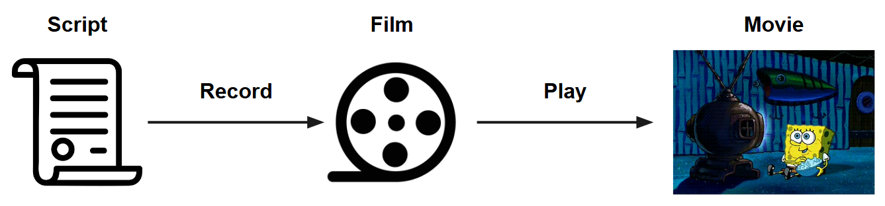
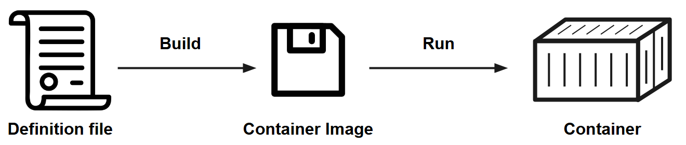

# Bioinformatics Cafe: Containers

*This tutorial covers the basics of how to use containers to deploy software.*

## Setup

1. Login to the HTC system, 

   ```
   ssh yourNetID@ap2001.chtc.wisc.edu
   ```

   or

   ```
   ssh yourNetID@ap2002.chtc.wisc.edu
   ```

   For more instructions, [read this guide](https://chtc.cs.wisc.edu/uw-research-computing/connecting)

2. Clone this repository.

   ```
   git clone github.com/chtc/biocafe-containers
   ```

3. Move into the new folder.

   ```
   cd biocafe-containers
   ```

4. Start an interactive build job by running

   ```
   condor_submit -i build.sub
   ```

## Materials

* Slides: [TBD](TBD)
* GitHub: [github.com/CHTC/biocafe-containers](https://github.com/CHTC/biocafe-containers)

## Quickstart: The Power of Containers

*A short hands-on exercise demonstrating how containers can be useful.*

Let's say that you need to use Python 3.10 for your research program.

First, check the version of Python available in the interactive job:

```bash
python3 --version
```

You should see Python 3.9.19.

Next, let's "build" a container.
For now, just run the provided commands - we'll discuss what each one is doing later in the training.

```bash
apptainer build python310.sif docker://python:3.10
```

When it is done, there is a new file `python310.sif`:

```bash
ls -lh python310.sif
```

Now that you have the `.sif` file of the container, you can use it as an execution environment for commands and scripts.

Let's see what version of Python is available in this container:

```bash
apptainer exec python310.sif python3 --version
```

It's Python 3.10!

Things to note:

* You did not install Python 3.10 on the execution point
* You did not remove Python 3.13 from the execution point
* Anywhere you have the `python310.sif` file (and Apptainer installed), you can do the same thing!

Furthermore, you can set up a container with the software you want to use.

The takeaway is: **Containers are portable, reproducible software environments that you control.**

## Core Concepts

*A simplified mental model for working with containers.*

There are some **core concepts** that you should know to work with containers.
Like many technologies, there is a lot going on behind the scenes, but like with driving a car, you don't need to know how the engine works in order to get around town.

We'll start with an analogy to movies.





The full point by point breakdown:

1. A **movie** is the sequence of images and sounds that you watch on the screen.
2. To watch a movie, you have to **run** or **play** it.
3. The **film** or other physical media stores the movie and is portable to other compatible devices.
4. To create a movie, you have to **build** or **record** the film.
   * If you want to make small changes to an existing movie, you can edit an existing film.
   * If you want to make major changes, you should record a new film.
5. A **script** is used to organize the events and scenes to be recorded on film for creating the movie.

This description of a movie is analogous to how containers work.

1. A **container** is the active environment that you can interact with.
2. To interact with a container, you must first **run** or **launch** it.
3. The **container image** stores the container and is portable to other compatible devices.
4. To create a container, you have to **build** the container image.
   * If you want to make small changes to an existing container image, you can "edit" it.
   * If you want to make major changes, you should build a new container image.
5. A **definition file** is used to organize the software and environment details for the build process.

> In the same way that the word **movie** can be used to refer to the physical media (the **film**, DVD, etc.) or the sequence of images on the screen,
> so too can the word **container** be used to refer to the **container image** or the actively running environment.

## Lifecycle for Deploying Software in Containers

*An overview of the step-by-step process of working with containers.*

**Deploying your software in a container is no more difficult than any other methods of deploying your software!**

Even if you don't use a container, you'll still need to learn how to install your software program, and **installing software is hard, period.**

**By using a container, you also get:**

* a **reproducible** environment
* **control** over the libraries and other programs you want to install
* simple deployment **separate** from the host operating system

Three phases to building containers:

* **Phase 1 - Setup**
* **Phase 2 - Build**
* **Phase 3 - Execute**

> In principle, Phases 1 & 2 are one-time only!

### Phase 1 - Setup

1. **Identify** the "main" software you want to deploy.
2. Find the **installation instructions** for the software you want to deploy.
   * Are there additional programs required in order for the software to work?
   * Is there a "major" platform you can use to install the software (e.g., `pip`, `conda`, `cran`)
3. Find a good **starting point**, a "base" container image to build on top of
   * A good rule is that the "base" container image should already include the most-difficult-to-install software that you need
   * **Note**: some developers publish official container images for their software!

### Phase 2 - Build

4. **Write a definition file**, containing the installation commands for the software you want
5. **Build the container image**
   * There are commonly issues with this step! Make changes to the definition file that address the error message you get.
6. **Test** that the software in the container image works as expected
   * A "successful" build doesn't mean the software is working!
  
### Phase 3 - Execute

7. **Distribute** the container image where it needs to go
8. **Use** the container image

## Example: A More Realistic Container

*A hands-on exercise for a practical example involving Conda.*

You are starting a new computational research project and have identified the "main" software that you want to deploy.

The program is a collection of scripts in a GitHub repository.
The README states that is requires **`samtools`** as well as **`python` v3.10** and the Python packages **`numpy` (v1.26)** and **`scipy`.**
They provide some commands to run that *should* fulfill the requirements:

```
conda install samtools python=3.10 numpy=1.26 scipy
```

For your own purposes, you also want to use **`bwa`** and the Python package **`seaborn`**. 

**How should you proceed?**

### Phase 1 - Setup

#### What do you need?

First, list out what you need. 

For the above scenario, you need:

* samtools
* bwa
* python v3.10
* python packages:
    * numpy v1.26
    * scipy
    * seaborn

> We're going to ignore the GitHub repository itself for now; more discussion later.

#### Installation instructions

The `conda install` command from the GitHub readme file should get you most of the way.
Since `seaborn` is just another Python package, Conda should have no trouble finding it.

The only remaining item then is `bwa`.
How can we install that?

You could try looking up the `bwa` source code, but unless you have a lot of experience installing stuff on Linux, it won't be clear how to proceed.

Instead, you should check out if `bwa` is available through the "Bioconda" channel.
Bioconda ([bioconda.github.io](https://bioconda.github.io)) is a source for biomedical software packages that can be installed by Conda.
You can search their packages [here](https://bioconda.github.io/conda-package_index.html).

A search of Bioconda for `bwa` does indeed return a match, so as long as we know how to install packages from Bioconda using Conda, we're good to go.
Getting Conda to use packages from Bioconda requires only a line or two of config.

Altogether, that means if we can get Conda set up, then we can install everything else we need using Conda.

#### A good starting point

Choosing a good base image can save a lot of time.

For information on how to find an official container, see the "Finding container images" section in at the end of this document.

Since everything we need can be installed using Conda, then **a good base container would come with `conda` already installed.**

If you are a fan of open source software, like we are, then you will want to use Conda-Forge ([conda-forge.org](https://conda-forge.org)).
Conda-Forge publishes an official container that provides Conda.

**TL;DR: you want to use `docker://condaforge/miniforge3:latest` as the base image for your container.**

### Phase 2 - Build

#### Write the definition file

*The exact format of the definition file depends on the container technology that you are using.*

We are focusing on the [Apptainer](https://apptainer.org/) container program, which is open source and designed for shared computing systems (and arguably more beginner friendly).

We've already written the definition file that you will need for this training.
Take a look at its contents by running

```bash
cat conda.def
```

There are a couple parts to the file:

1. **Header** - this section defines the starting point for your container build
2. **`%post` commands** - this section has the installation commands you want included in the final result

   * The `conda config` commands enable Bioconda as a source for packages
   * The `conda install` command actually installs the packages

> For a full breakdown of the parts of an Apptainer definition file, see
>
> * [CHTC Apptainer guide](https://chtc.cs.wisc.edu/uw-research-computing/apptainer-build.html)
> * [Apptainer manual](https://apptainer.org/docs/user/latest/definition_files.html)
>

#### Build the container

At this point, the script for the movie is written.
Now you need to record it to film.

To build an Apptainer container, you use the command

```
apptainer build <desired_name> <definition_file>
```

* The first argument is the filename you want the container image to have
* The second argument provides the instructions for building the container image (the definition file)

For our example, that means the command to run is

```bash
apptainer build conda.sif conda.def
```

The output of this command details the container build process, including the installation commands.

1. First, Apptainer **obtains the base container**, in this case by downloading it from DockerHub.

   This involves multiple files and extractions - you don't need to worry much about what is happening here.

2. Next, Apptainer **runs the `%post` section commands** of the definition file.

   This section is separated from the previous by the `INFO: Running post scriptlet` line. 
   If you are familiar with `conda install` commands, the output is the almost exactly the same as usual!

   > In the quickstart, this middle step was skipped 

3. Finally, once the `%post` commands have all run (typically "successfully"), Apptainer **records the results as a `SIF` formatted file.**

   The process is complete once you see `Build complete`.

Confirm that the container image has been created by running:


```bash
file conda.sif
```

#### Test/use the container

It's always good practice to review the final product. 

You can use the `shell` command to interact with the container directly:

```
apptainer shell my-container.sif
```

After running this command, your command prompt will appear as `Apptainer>`.
Now the commands that you run will use the environment provided by your container image.

In general, if you can get the "help" text for a command or load a package, it is a strong indication that the software was installed as expected.

Let's check that the Bioconda tools were installed. First let's check `samtools` by running

```bash
samtools --help
```

You should see the help text explaining how to use the `samtools` command.

Next, let's check for `bwa` by running

```bash
bwa --help
```

You should see the help text explaing how to use the `bwa` command.

Then we'll confirm that the version of Python is 3.10, as we require.

```bash
python3 --version
```

We should see version `3.10`; we won't worry about the particular "patch" version that is reported after the second decimal point.

Then we'll launch a Python console so that we can import the Python packages we installed.

```bash
python3
```

This opens the interactive Python console. Now we can run our desired Python commands:

```python3
import numpy, scipy, seaborn

print(f"numpy = {numpy.__version__}")
print(f"scipy = {scipy.__version__}")
print(f"seaborn = {seaborn.__version__}")
```

(You should be able to copy/paste all lines at once, or you can do one line at a time.)

You should see that `numpy` is `1.26`, but there's no guarantee about what versions `scipy` and `seaborn` will have since we did not declare a specific version for these packages in our `conda install` command.

When you are done running Python test commands, run

```python3
exit()
```

When you are done testing the container image, enter

```bash
exit
```

to exit the interactive shell mode.

> In general, **anywhere** you have Apptainer, you can run the above commands to reproduce the software environment you created in your container!

### Phase 3 - Execute

Once you've tested that the container works, it's time to use it.
HTCondor makes this easier than you might think.

#### Distributing the container

Before exiting the interactive job where you built the container `.sif` image, you should move the container image file to your `/staging` directory.

```bash
mv conda.sif /staging/$USER/conda.sif
```

Then you can exit the interactive job.
If you created or modified the corresponding `.def` file during the interactive job, it will be automatically returned to your `/home` directory on exit.

> If you forget to move the `.sif` file to staging, it will be automatically returned to your `/home` directory.
> No worries if that happens - just run the above `mv` command a couple minutes after the job has ended.
> (It can take a couple of minutes for a large file to be transferred back.)

Once the container image is in `/staging`, then we can access it just like any other large file in `/staging`.

In general, we recommend using the OSDF for the file transfer.
In your submit file, you'll use the address

```
osdf:///chtc/staging/yourNetID/conda.sif
```

to specify the location of the container.

> Note that items transferred using the OSDF **must not be changed**.
> If you do need to modify the item, you should also change its name!!

If you are using a shared group staging directory, or otherwise don't want to use the OSDF, you can use the address

```
file:///staging/groups/yourGroupDirectory/conda.sif
```

in your submit file, but you will also need to include the line

```
requirements = (HasCHTCStaging == True)
```

to ensure the execution point can access the staging directory.

For more information on using the `/staging` directory, [read the guide here](https://chtc.cs.wisc.edu/uw-research-computing/file-avail-largedata).

#### Using the container with HTCondor

The software that runs the HTC system, called HTCondor ([htcondor.org](https://htcondor.org)), comes with built-in container support for both Apptainer (today's focus) and Docker.
All you need to do is tell HTCondor where the container is located, and it will handle the rest.

In your submit file, all you need to do is add the line

```
container_image = locationOfYourContainer
```

As long as the location is something that HTCondor understands how to transfer, the job will automatically fetch the container image and run the appropriate `exec` command.

### Test Jobs

*We've provided example submit files to explore HTCondor jobs using containers.*

Now that we have all the pieces, let's see the container in action.

First, move into the `testjobs` directory:

```bash
cd testjobs/
```

> Make sure you have exited your interactive job! Just enter `exit` until you see `ap2001` or `ap2002`.

#### The submit files

We've provided two submit files: `no-container.sub` and `container.sub`.

Take a look at the contents of the first file by running

```bash
cat no-container.sub
```

Take a look over the contents to make sure you understand what this test job is doing.
Once you understand this submit file, take a look at the other one by running

```bash
cat container.sub
```

What has changed?

> If you'd like some help comparing the two files, run the command
>
> ```bash
> diff -y no-container.sub container.sub
> ```

Each test job is executing the `test.sh` script (which itself is just checking the versions of stuff we added to the container).
The `no-container.sub` does not use a container, while the `container.sub` does use a container (note the additional `container_image` line in the file).

#### Run the jobs

Submit each of the test jobs:

```bash
condor_submit no-container.sub
```

```bash
condor_submit container.sub
```

You can monitor their progress by running the command

```bash
condor_watch_q
```

#### Examine the results

Once completed, take a look at the output files generated by the two test jobs.

First let's look at the job that did not use a container:

```bash
cat no-container.out
```

You should see versions reported only for `python3` and `numpy`, and not anything else.
Without the container, you are using whatever software the execution point happens to have installed, which does not include `bwa` or `samtools` or the other python packages.
In fact, you can see corresponding error messages in the `.err` file:

```bash
cat no-container.err
```

Now if we look at the job that used a container, we'll see what we want to see:

```bash
cat container.out
```

```bash
cat container.err
```

The `.out` file reports a version for each of the packages that we checked, and the `.err` file should be empty.

#### Reproducibility

Importantly, as long as we are using the exact same `.sif` file for our job/calculation/script, **we'll always get the same software versions**!

You can confirm this by running

```bash
apptainer exec /staging/$USER/conda.sif ./test.sh
```

You should see the exact same output as you did in the `container.out` file!!

> NOTE: In general, you should not run `apptainer exec` on the execution point, unless it is for something simple like this.
> For anything more complicated or intense, you should start an interactive job first!
> In this case, you could just do `condor_submit -i container.sub`.

### Putting scripts in the container

*How should you get those scripts into the container image?*

In the initial scenario, we proposed that you are a researcher trying to use some scripts in a GitHub repository.
How should you handle these scripts?

First, you have to answer this question: when should the scripts be placed inside the container image?

1. During the build phase
2. During the execution phase

#### Adding scripts during the build phase

**This option is for "mature" programs** - that is, something that you don't plan to modify after the build phase is complete and the container image has been created. 
Maybe you'll make changes, but you can plan on repeating the build phase to create a new container image in that case.

To add files to the container build, you can use the `%files` section of the definition file, as described [here](https://apptainer.org/docs/user/latest/definition_files.html#files).
(This is specific to Apptainer, but other container technologies have an analogous method; the specific syntax varies.)

If the files are publicly available, you can instead include a `git clone`, `wget`, or some other download command in the `%post` section to fetch the files during the build phase.

#### Adding scripts during the execution phase

**This option is best for "developing" programs** - that is, something that you are actively developing. Because you are frequently making changes to the scripts, you want to skip the build phase as much as possible.

When using HTCondor, scripts included in the `transfer_input_files` line of your submit file will be automatically added to the container at the run time of the job.

## CHTC Container Support

*We're here to help you through your container journey.*

### Guides

Our website has a lot of information about working with containers.

* [Overview (start here!)](https://chtc.cs.wisc.edu/uw-research-computing/software-overview-htc)

**Apptainer**

* [Use and build Apptainer containers](https://chtc.cs.wisc.edu/uw-research-computing/apptainer-htc)
* [In depth guide to Apptainer definition file](https://chtc.cs.wisc.edu/uw-research-computing/apptainer-build)
* [Advanced example of Apptainer definition file](https://chtc.cs.wisc.edu/uw-research-computing/apptainer-htc-advanced-example)
* [Convert Docker container into Apptainer container](https://chtc.cs.wisc.edu/uw-research-computing/htc-docker-to-apptainer)

**Docker**

* [Use Docker containers](https://chtc.cs.wisc.edu/uw-research-computing/docker-jobs)
* [Build your own Docker container (on your computer)](https://chtc.cs.wisc.edu/uw-research-computing/docker-build)
* [Test your Docker container before using on CHTC](https://chtc.cs.wisc.edu/uw-research-computing/docker-test)

### Tutorials

Today's training is a practical introduction for Conda containers.
If you want a more general introduction to containers, see our previous tutorial:

[github.com/CHTC/tutorial-containers](https://github.com/CHTC/tutorial-containers)

### Recipes

Don't reinvent the wheel!

In our "Recipes" repository, we curate example definition files for installing a variety of software in containers.

Check it out at [github.com/CHTC/recipes](https://github.com/CHTC/recipes), especially the `software` section.

If you have a container recipe that you want to share with other users, let us know and we'll work with you to add it to the repository!

### Facilitation

The Facilitation team is here to help.
We're happy to chat with you about the software you want to set up, regarding any phase of the container process.
To connect with the Facilitation team, see the "Get help" section below.

## Next Steps

*Where to go from here.*

### Build your own container

Now that you've learned the basics, you should try building a container for **your** software!
Check out the examples in the Recipes repository for inspiration, read our guides for guidance and tips, and reach out when you get stuck.

### Get help

For support, **you can email `chtc@cs.wisc.edu`.**

**We also have twice weekly office hours**, online on Zoom, for CHTC users every Tuesday and Thursday. [Details here](https://chtc.cs.wisc.edu/uw-research-computing/get-help.html#office-hours).

**CHTC Community Forum** is a new web forum for CHTC users to connect with the facilitation team and other users! [Check it out here](https://community.chtc.wisc.edu/).

### Upcoming opportunities

**We host a weeklong "OSG School" over the summer**, where participants learn more about high throughput computing on the OSPool. **Applications are now open** for this year, in Madison, WI, from July 13-17. More information at [osg-htc.org/school-2026](https://osg-htc.org/school-2026/).

**We host an annual conference on high throughput computing.** This year is **HTC26**, from June 9-12 in Madison, WI. Agenda is still being planned out. See the [save-the-date announcement](https://osg-htc.org/events/2026/06/09/throughput-computing-week/) for more information. Last year's conference website is [here](https://agenda.hep.wisc.edu/event/2297/).

-----

## Additional information

### Containers are immutable

Another important item to note is that **most locations "in" the container image are read-only**.

Sometimes, a program will try to write files into the root directory. There are generally two cases:

1. The program is trying to use a default location that evaulates to a read-only location.
2. The program is trying to use a specific absolute path.

The most common occurence of (1) is that during installation, the program used the value of `HOME` to be the root directory (`/`). This problem can be usually resolved by including a `export HOME=<value>` statement with `<value>` replaced by a mounted location in the container. Some programs may have more specific settings to manipulate, such as a "cache" location or some other setting. Digging into the documentation usually reveals the setting you should change.

There are two main causes of (2): (a) your script uses absolute paths or (b) you are using a container specifically written for Docker.

* (a): Often researchers who write their own programs start on their personal computer. To stay organized, they have some code that says all outputs should go into a directory like `/User/Documents/Research/Project3/outputs`, while maybe the script itself lives in `/User/Programs/my_code.py`. To work in containers (and shared computing systems), the researcher should modify their code to work with relative paths instead.
* (b) The "normal" installation of Docker does allow some writing in the root directory (`/`), so some developers will use paths like `/data` or `/app` for writing temporary files. Sometimes the "official" container you are using follows this paradigm. You may be able to modify the container to work around this issue, but it may be easier to build a new container where you manually install the software yourself.

### Finding container images

A lot of mainstream softwares (and even niche softwares, depending on the developer) have official containers published on the internet for anyone to use.
In general, most of these containers are published on "DockerHub", which is kind of like "GitHub", but for container images.
Keep in mind, though, that anyone can publish containers on DockerHub!

When you search for containers on DockerHub, look for images with the labels `Docker Official Image`, `Verified Publisher`, or `Sponsored OSS`.
These will generally be safe to use, but like with anything on the internet, you should do some due diligence to make sure the publishers are legitimate. 

For example, let's try to find a container image that has Python v3.10. 
When you search DockerHub for `python`, you should see a result for a "Docker Official Image". 
Clicking on the result takes you to [this page](https://hub.docker.com/_/python), which lists a lot of information.
You can then look at the `Tags` tab for the particular version of the container you are interested in. 
In this case, if you search "3.10", you'll get 19 pages of results (!). 
But for these foundational softwares, the more "general" tag will usually work. That is, requesting `python:3.10` will automatically grab the latest version of the 3.10 container.

**As a general rule, you should avoid using the `latest` tag!**
This tag is always updated to whatever the most recent version is, which means you won't be able to reproduce the container build in the future!

> Smaller, less "foundational" softwares will have much fewer results that are easier to look through.
> Once you've decided on a version, you want to look for the text `docker pull <reponame>/<imagename>:<tagname>`.
> You can then use the corresponding address `docker://<reponame>/<imagename>:<tagname>` in compatible container technologies to reference that container image.
>
> Because `python` is an official repository, the `<reponame>` and `<imagename>` are combined into one.

### Setting PATH

In Linux, except for the most basic commands, every command is just a file in a directory somewhere. 
The `PATH` environment variable stores the list of the directories that should be checked when looking for a command.
When you type a command into the terminal and hit "enter", you are telling the terminal to search the `PATH` locations and execute the first match it finds.
If there are no matches, you'll get a "command not found" error. 

There are some default locations set for the `PATH` variable; you can see them by running `echo $PATH`.
Note that the locations are separated by colons (`:`), and they are searched in order from left to right.

To be able to run a script anywhere as a command, the directory containing the script must be in this `PATH` list. 
You can either (a) move/copy the script into a default location, or (b) update the `PATH` value to include said directory.
Since research software can be location sensitive, it is usually best to update the `PATH` value. 

#### Setting PATH at runtime

At anytime, whether or not you are using a container, you can update the `PATH` value to add another location. 
Caution is needed, however, because if you mess it up, you won't be able to run most commands!!
Specifically, you want to **add** a location to the `PATH` value **without removing existing locations**. 

First, save a copy of the previous value with

```
export OLD_PATH="$PATH"
```

This defines a new variable `OLD_PATH` to keep the backup of the value.

If you are adding a location to the `PATH`, you usually want to match the command in that location before any other locations, so you need to prepend the value.
This command will do that, where you should replace `/path/to/new/location` with the desired location.

```
export PATH="/path/to/new/location:$OLD_PATH"
```

If something goes wrong with this command, you can undo the changes by running

```
export PATH="$OLD_PATH"
```

If that doesn't work, exit the terminal and login again.
That will reset the value of `PATH` set during the session.

#### Setting PATH during container build

If you know that you will always want to access a command, you can set the value of PATH during the container build.
To do so, you will need to know the absolute path to the necessary location (inside of the container) in advance.
If you're not sure what this path is, it may be easiest to build the container and then test setting the `PATH` as described in the "Setting PATH at runtime" section.

In Apptainer, you specify runtime environment variables in the definition file using the `%environment` section, as in the following example.

```
Bootstrap: docker
From: ubuntu:22.04

%post
    mkdir -p /opt/custom-software
    cp /usr/bin/ls /opt/custom-software/my-ls

%environment
    export PATH="/opt/custom-software:$PATH"
```

When the container is built, it will run the commands in the `%post` section.
The commands in the `%environment` section will be *saved* into the container image.
When you launch the container, the commands that were in the `%environment` section will be executed at startup. 

If you have multiple locations you want to add to the `PATH`, you should declare that in a single `export PATH=` line in the `%environment` section.
Avoid using complicated logic in this section. 
If you need something more complex, you should probably include it as a script in the container and remember to execute it after startup.

### Troubleshooting errors

#### Command not found

If the container build is successful, but you get a `command not found` error when you try testing the container, then either

1. the command is not in the list of directories contained by the `PATH` variable, or
2. the installation did not succeed (but the container image was created anyways).

In the first case, you may just need to add the directory containing the command into the `PATH` variable. 
See the previous section `Setting PATH` for instructions.

In the second case, you'll need to look at the build output for error messages, the earlier the better.
Most likely there is a problem with a missing dependency, as covered in a following section.

It could also be that the installation command you are using doesn't install what you want!
For example, there are some Python programs that have one package for using the program directly in Python, but another package for using the program via the command line.
Consult the documentation for the software you are trying to install.

#### Build is stuck

Here, the build command is still running but there's been no updates to the output in quite a while (>5 minutes). 
Some software takes a while to run, and is not verbose about the process. 
Sometimes, though, the installation is waiting for interactive feedback in order to proceed.

Check the last few lines of the output.
If you don't see a question or prompt for information, then you may just need to wait some more.

> If you're sure the installation is running, but still want to be able to monitor progress, you can investigate if the installation command has a "verbose" option.

If you see a question or prompt for information, it could be that the installation is waiting for user interaction to proceed.
However, user interaction is not well supported during the container build step (and even if it was, it would be poorly reproducible).
In this case, you should cancel the build and investigate what's triggering the interactive prompt.

The most common case I've encountered is the `tzdata` package in Debian, usually required as a dependency to some other program. 
This can be addressed by adding

```
export DEBIAN_FRONTEND=noninteractive
```

before the `apt install` commands in the `%post` section.

The next most common case is the interactive installer used by `miniconda`. 
While the `miniconda` installer has a non-interactive mode (look for "batch installation" instructions), you can also just use an official conda container as the base.
(I recommend using the [`miniforge` container](https://hub.docker.com/r/condaforge/miniforge3).)

#### Missing dependencies

Because container images can easily get large (10s of GB), most published containers have been very stripped down - they only contain the bare minimum necessary to execute the main program.
Unless the software you want to install happens to share the same set of requirements as the original software in the published container, you will encounter missing dependencies during the installation.
Sometimes these error messages can be rather obtuse.

The best strategy is to look up the installation instructions for your software to find their stated requirements, then add instructions to the container build to set up those dependencies.
Documentation can be sparse or incomplete with research software, however, so the stated requirements may not be enough.

The next strategy, then, is to understand what the error message means.
Some programs will be explicit and say something like `Missing package X - use 'apt install Xdev' to satisfy requirements.`
If the error message is not very helpful, an internet search for the error message and the software you are installing can turn up some tips. 

In most cases, that should be as easy as adding some libraries using the operating system package manager (`apt`, `yum`, etc.). 
Sometimes, though, the dependencies are difficult to install. 
In that case, you may want to consider changing your base container to something that already has the necessary dependencies installed.
That isn't always an option, however.

### Containers and GPUs

Containers can use GPUs, but getting the software to talk with the GPU correctly can be tricky to get right.

Generally, the best approach is to use the official CUDA containers for NVIDIA GPUs as the starting point, if using NVIDIA GPUs. These containers are listed at https://hub.docker.com/r/nvidia/cuda. 
The version should match the driver version of the CUDA driver on your GPU machines.
(If you aren't using NVIDIA GPUs, you will need to do your own research!)

You'll also need to make sure that the software you are deploying is compatible with the GPU hardware you are trying to use. In general, older software should work fine on newer GPUs, but new software may not work on old GPUs.

* [List of "capability" support for NVIDIA GPUs](https://en.wikipedia.org/wiki/CUDA#GPUs_supported)
* [NVIDIA explanation of "capability"](https://docs.nvidia.com/cuda/cuda-programming-guide/01-introduction/cuda-platform.html)

If you run into errors on some GPUs but not others, consider the possibility that the issue has to do with differences in the GPU hardware generation.

At CHTC, we have sorted out most of the backend details to ensure that containers can use the GPUs. To learn how to submit GPU jobs on CHTC, [read this guide](https://chtc.cs.wisc.edu/uw-research-computing/gpu-jobs).

### Containers and CPU Architectures

Like other software, containers can be sensitive to the CPU architecture used by the CPU hardware itself.
In general, if you built a container on one type of CPU architecture, it should be useable on other computers using the same type of CPU architecture.

The most common issue occurs when a user builds their container on their MacOS computer (using the ARM architecture) and tries to run it on a shared cluster, which typically uses the x86_64 architecture.
One of a couple of things may happen in that case:

* Their program encounters an `Illegal instruction` error
* Their program runs much more slowly than expected

The first case is usually pretty obvious when it happens and easy to identify as an architecture problem.
The second case is sinister in its subtlety, especially for users who don't know how fast the calculation should run.

For a discussion of CPU architecture considerations, see...

* ...for Apptainer, [this manual page](https://apptainer.org/docs/user/latest/docker_and_oci.html#specifying-an-architecture)
* ...for Docker, [this manual page](https://docs.docker.com/build/building/multi-platform/)

### What about performance?

Is it slower to use a container?

That is a valid question. **In general, the answer is "no"**, though there can be exceptions.

For the purposes of this discussion, an operating system consists of three levels: the hardware layer, the "kernel" layer, and the "application" layer.

* The application layer contains everything that you are used to interacting with on a computer - windows, menus, settings, software installations, so on.

* The kernel layer is an interface - the application layer sends standardized instructions to the kernel and the kernel is responsible for converting that into the appropriate 1s and 0s that are sent to the hardware. ("Drivers" typically live at the kernel level.)

When you launch a container, you effectively create a second "application" layer that exists at the same level as the application layer of the main operating system.
The difference is that the capabilities of this container application layer have been restricted from certain operations to prevent it from fully supplanting the main OS application layer.

The container and the main OS application layers live side-by-side, each sending their standardized instructions to the same kernel layer. 

When a user interacts with the computer, they interact either with the main OS application layer (outside the container) or with the container application layer (inside the container). Regardless of which one they use, the command a user runs has the same "distance" between the application layer and the hardware layer, and so the speed of execution is comparable. 
